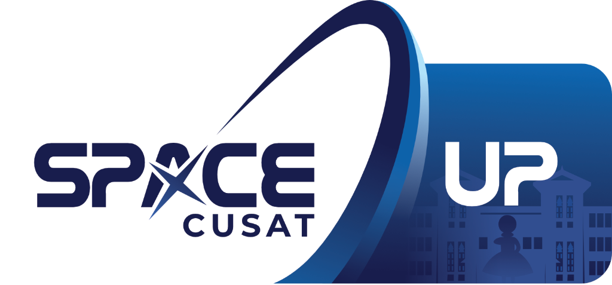
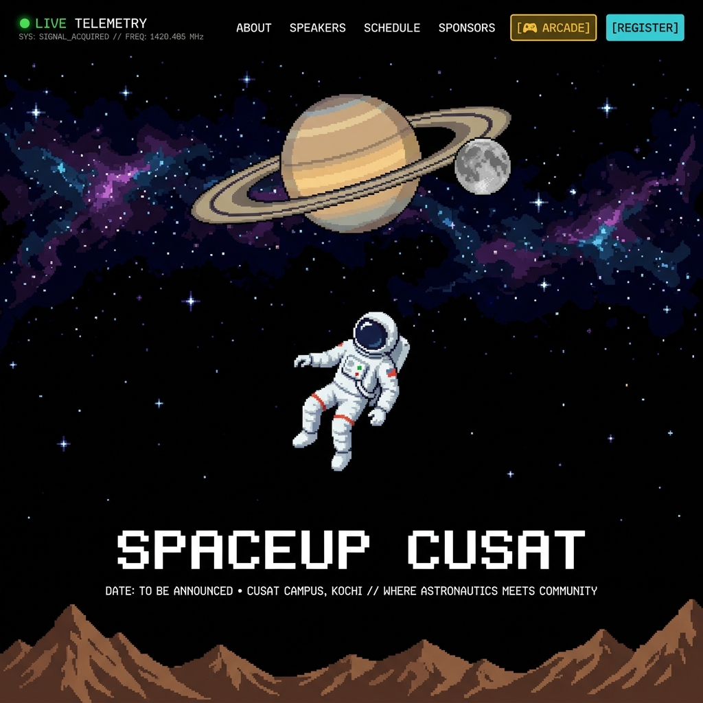

< — Students for the Exploration and Development of Space, CUSAT Chapter**

<br/>



<br/><br/>


</div>

---

## 🖼️ Preview


*SpaceUp CUSAT — 16-Bit retro arcade space interface with parallax hero, custom cursor, embedded arcade, and cyberpunk UI.*

---

## 📌 About

**SpaceUp** is a participant-driven **space unconference** — no fixed agenda, no passive audiences. Attendees propose sessions, vote on topics, and shape the event in real-time. This website serves as the flagship digital portal for **SpaceUp Vol 8**, organized by SEDS CUSAT at Cochin University of Science and Technology, Kochi.

The platform is built to captivate visitors with a **16-bit retro arcade space aesthetic** — dynamic starfields, CRT overlays, pixel fonts, mouse-parallax hero layers, and an embedded space shooter mini-game.

---

## ✨ Features

### 🎨 Visual Design & Animations
| Feature | Description |
|---|---|
| **Parallax Hero** | 5-layer scene — nebula, stars, Saturn + moon, floating astronaut, and terrain — all responding to mouse movement |
| **Custom Space Cursor** | Canvas-driven crosshair with animated star particle trails and element hover detection |
| **Twinkling Starfield** | Dynamic canvas background with twinkling stars and passing shooting stars |
| **CRT Scanline Overlay** | Full-screen retro CRT effect layered over all content |
| **Terminal Boot Loader** | CLI-style boot sequence with progress bar on initial load |
| **Scroll Reveal** | `IntersectionObserver`-powered entrance animations for every section |
| **Marquee Ticker** | Infinite scrolling keyword strip between hero and content |
| **SpaceUp CUSAT Logo** | Official branding in navbar (with hover glow) and hero section |

### 📑 Content Sections
| Section | Component | Description |
|---|---|---|
| **Hero** | `Hero.jsx` | Parallax space scene with SpaceUp 26 logo, date/venue info, Register & Play Arcade CTAs |
| **About** | `About.jsx` | Mission overview, animated stat counters, feature cards |
| **Speakers** | `Speakers.jsx` | 3D flip cards with neon avatar badges and placeholder speaker details |
| **Schedule** | `Schedule.jsx` | Tabbed day switcher with expandable timeline entries |
| **Sponsors** | `Sponsors.jsx` | Platinum, Gold, Silver tier cards with scanline hover effects |
| **Footer** | `Footer.jsx` | SEDS CUSAT contacts, CUSAT campus telemetry coordinates |

### 🕹️ Space Arcade Mini-Game
- **Full-Screen Arcade Page** — toggleable from the navbar or hero section
- **Ref-Backed 60FPS Engine** — mutable `useRef` state to eliminate React closure races
- **Controls** — Arrow keys, WASD, Spacebar, touch drag, and on-screen D-Pad for mobile
- **Mechanics** — Dual auto-firing cyan lasers, procedural asteroid polygons, particle explosions, progressive difficulty, and `localStorage` high score persistence
- **Audio System** — Procedural Web Audio API sound effects (laser fire, explosions, power-ups, game over) with global mute toggle

### 🔧 Developer-Friendly Architecture
- **Pre-wired Registration** — Buttons with unique IDs (`#hero-register-btn`, `#nav-register-btn`) linked to `https://spaceup2026.vercel.app/register`
- **Modular Placeholder System** — All sections preserve grid layouts and card structures for easy content population
- **Responsive Design** — Fully responsive across desktop, tablet, and mobile with dedicated mobile menu overlay

---

## 📁 Project Structure

```
SEDS-SpaceUp/
├── public/
│   ├── favicon.png                # SpaceUp CUSAT logo favicon
│   ├── apple-touch-icon.png       # iOS home screen icon
│   ├── demo_preview.png           # README preview screenshot
│   └── icons.svg                  # Icon sprites
├── src/
│   ├── assets/
│   │   ├── hero/                  # Parallax hero layers (nebula, stars, saturn, moon, astronaut, terrain)
│   │   ├── spaceup26_logo.png     # SpaceUp Vol 8 event logo (hero section)
│   │   ├── spaceup_cusat_logo.png # SpaceUp CUSAT branding logo (navbar + favicon)
│   │   └── spaceup_logo.png       # Legacy logo
│   ├── components/
│   │   ├── About.jsx / .css       # Mission brief terminal & stats
│   │   ├── ArcadeGame.jsx / .css  # Canvas space shooter engine
│   │   ├── ArcadeGamePage.jsx / .css  # Full-screen arcade wrapper
│   │   ├── CustomCursor.jsx / .css    # Particle trail crosshair cursor
│   │   ├── Footer.jsx / .css      # Telemetry & contact footer
│   │   ├── Hero.jsx / .css        # Parallax layers & launch info
│   │   ├── LoadingScreen.jsx / .css   # Retro CLI loading animation
│   │   ├── MarqueeStrip.jsx / .css    # Infinite scrolling ticker
│   │   ├── Navbar.jsx / .css      # Fixed glassmorphism nav with logo & signal monitor
│   │   ├── Schedule.jsx / .css    # Interactive timeline & day switcher
│   │   ├── ScrollReveal.jsx       # Scroll-triggered entrance wrapper
│   │   ├── Speakers.jsx / .css    # 3D card flip crew manifest
│   │   ├── Sponsors.jsx / .css    # Tiered sponsors & registration CTA
│   │   └── StarField.jsx         # Canvas twinkling stars background
│   ├── utils/
│   │   └── audio.js              # Web Audio API procedural sound effects
│   ├── App.jsx                    # Application root & view routing (home / arcade)
│   ├── main.jsx                   # React DOM render entry point
│   └── index.css                  # Global design system (tokens, fonts, utilities)
├── index.html                     # Entry HTML with meta tags & Google Fonts
├── package.json                   # Project dependencies & scripts
└── vite.config.js                 # Vite build config (Port 3000, auto-open)
```

---

## 🛠️ Getting Started

### Prerequisites
- **Node.js** v18.0.0 or higher
- **npm** (comes with Node.js)

### Setup & Run

```bash
# 1. Clone the repository
git clone https://github.com/DamianAntony/SEDS-SpaceUp.git
cd SEDS-SpaceUp

# 2. Install dependencies
npm install

# 3. Start development server (opens at http://localhost:3000)
npm run dev

# 4. Build for production
npm run build

# 5. Preview production build
npm run preview
```

---

## 🎨 Design System

The entire UI is driven by CSS custom properties defined in `src/index.css`:

### Color Palette
| Token | Value | Usage |
|---|---|---|
| `--color-bg-deep` | `#07080f` | Deep space background |
| `--color-bg-primary` | `#0a0e17` | Primary background |
| `--color-accent-gold` | `#FF4D8D` | Primary pink accent (buttons, highlights) |
| `--color-accent-cyan` | `#00E5FF` | Cyan accent (links, borders, glow) |
| `--color-accent-orange` | `#9B5DE5` | Purple accent (effects, gradients) |
| `--color-terminal-green` | `#00ff41` | Terminal / signal indicator green |

### Typography
All text uses the **Press Start 2P** pixel font to enforce the 16-bit retro aesthetic globally.

```css
--font-pixel: 'Press Start 2P', monospace;
```

---

## 📝 Guide for Coworkers

### Updating Event Content

| What to Update | Where |
|---|---|
| **Date & Venue** | `Hero.jsx` → `hero-info` text |
| **Speaker Profiles** | `Speakers.jsx` → `speakers` array (names, titles, bios, topics, colors) |
| **Schedule / Timeline** | `Schedule.jsx` → `scheduleData` object (times, sessions, types) |
| **Sponsor Logos** | `Sponsors.jsx` → `sponsorTiers` (company names, logos) |
| **Registration URL** | `Hero.jsx`, `Navbar.jsx`, `Sponsors.jsx` → update `href` on register buttons |
| **Contact / Socials** | `Footer.jsx` → email, social links, coordinates |

### Pre-Wired Element IDs
These IDs are ready for analytics, event tracking, or API integration:
- `#hero-register-btn` — Hero section register button
- `#nav-register-btn` — Navbar register button
- `#navbar` — Main navigation bar

---

## 🤝 Team

Developed with ❤️ by the **SEDS CUSAT Technical Team** for **SpaceUp CUSAT Vol 8**.

<div align="center">
<br/>
<sub>CUSAT Campus, Kochi — 10.0435° N, 76.3242° E</sub>
<br/>
<sub>seds@cusat.ac.in</sub>
</div>
]]>
